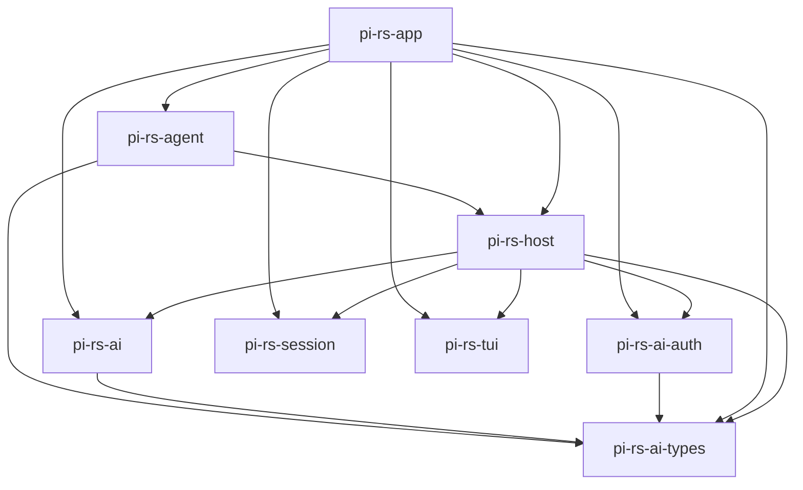

<!-- GENERATED FILE — do not edit by hand.
     Regenerate: scripts/gen-arch.sh
     Freshness is enforced by `nix flake check` (checks.arch-fresh). -->

# Architecture map (generated)

Structural map of the workspace, extracted from the code. For rationale,
invariants, and dataflow, see DESIGN.md.

## Crate dependency graph

Internal (workspace-local) dependencies only. `A --> B` means A depends on B.



## Crates

| Crate | Description |
|-------|-------------|
| `pi-rs-agent` | packages/agent port: Lua-authored agent policy pack |
| `pi-rs-ai` | packages/ai port: transport (HTTP/SSE/retry/cancellation), protocols, registry |
| `pi-rs-ai-auth` | packages/ai oauth port: PKCE engine, flows as data, provider registry |
| `pi-rs-ai-types` | packages/ai type vocabulary: models, messages, content, usage, stream events |
| `pi-rs-app` | _no description in Cargo.toml_ |
| `pi-rs-host` | Lua extension host: coroutine async seam, event bus, watchdog |
| `pi-rs-session` | Session manager: append-only JSONL session trees (port of core/session-manager.ts) |
| `pi-rs-tui` | _no description in Cargo.toml_ |

## Module structure

Per-crate module/item trees (`cargo modules structure`). Functions are
omitted; types, traits, and module boundaries are the architecture.

### `pi-rs-agent`

```

crate pi_rs_agent
└── struct AgentEvent: pub
```

### `pi-rs-ai`

```

crate pi_rs_ai
├── mod protocols: pub
│   ├── struct ProtocolError: pub
│   ├── mod anthropic: pub
│   │   ├── struct AnthropicOptions: pub
│   │   ├── enum AnthropicThinkingDisplay: pub
│   │   ├── enum AnthropicToolChoice: pub
│   │   ├── struct BlockMeta: pub(self)
│   │   ├── struct PreparedRequest: pub(self)
│   │   └── struct ResolvedCompat: pub(self)
│   ├── mod cloudflare: pub
│   ├── mod copilot_headers: pub
│   ├── mod openai_completions: pub
│   │   ├── struct OpenAICompletionsOptions: pub
│   │   ├── enum OpenAIToolChoice: pub
│   │   ├── struct PreparedRequest: pub(self)
│   │   ├── struct ResolvedCompat: pub(self)
│   │   └── struct ToolMeta: pub(self)
│   ├── mod openai_prompt_cache: pub
│   ├── mod options: pub
│   │   ├── type PayloadHook: pub
│   │   ├── type ResponseHook: pub
│   │   ├── struct SimpleStreamOptions: pub
│   │   └── struct StreamOptions: pub
│   ├── mod simple_options: pub
│   │   └── struct AdjustedTokens: pub
│   └── mod transform_messages: pub
│       └── type NormalizeToolCallId: pub
├── mod registry: pub
│   ├── mod api_registry: pub
│   │   ├── struct ApiProvider: pub
│   │   ├── type ApiStreamFn: pub
│   │   ├── type ApiStreamSimpleFn: pub
│   │   └── struct Registered: pub(self)
│   ├── mod catalog: pub
│   │   └── struct ProviderModels: pub(self)
│   ├── mod env_api_keys: pub
│   └── mod stream: pub
├── mod transport: pub
│   ├── enum TransportError: pub
│   ├── mod abort: pub
│   │   └── struct AbortSignal: pub
│   ├── mod event_stream: pub
│   │   ├── type AssistantMessageEventStream: pub
│   │   ├── type CompleteFn: pub(self)
│   │   ├── struct EventStream: pub
│   │   ├── enum ResultSlot: pub(self)
│   │   └── struct State: pub(self)
│   ├── mod http: pub
│   │   ├── struct RetryOptions: pub
│   │   └── enum RetryPolicy: pub
│   ├── mod retry: pub
│   └── mod sse: pub
│       ├── struct SseDecoder: pub
│       ├── struct SseEvent: pub
│       └── struct SseReader: pub
└── mod util: pub
    ├── mod headers: pub
    ├── mod json_parse: pub
    │   ├── struct Parser: pub(self)
    │   └── enum PartialJsonError: pub
    └── mod sanitize: pub
```

### `pi-rs-ai-auth`

```

crate pi_rs_ai_auth
├── mod anthropic: pub(crate)
├── mod callback_server: pub(crate)
│   ├── struct CallbackCode: pub
│   ├── struct CallbackPages: pub
│   └── struct CallbackServer: pub
├── mod device_code: pub(crate)
│   └── enum DeviceCodePoll: pub
├── mod engine: pub(crate)
│   ├── struct PkceFlow: pub
│   └── struct TokenResponse: pub(self)
├── mod error: pub(crate)
│   └── enum AuthError: pub
├── mod github_copilot: pub(crate)
│   ├── struct GitHubCopilotEndpoints: pub
│   └── struct GitHubCopilotFlow: pub
├── mod oauth_page: pub(crate)
│   └── struct PageOptions: pub(self)
├── mod openai_codex: pub(crate)
│   ├── struct OpenAiCodexEndpoints: pub
│   └── struct OpenAiCodexFlow: pub
├── mod pkce: pub(crate)
│   └── struct Pkce: pub
├── mod registry: pub(crate)
│   └── struct OAuthApiKeyResult: pub
└── mod types: pub(crate)
    ├── type AuthFuture: pub
    ├── struct OAuthAuthInfo: pub
    ├── struct OAuthCredentials: pub
    ├── struct OAuthDeviceCodeInfo: pub
    ├── trait OAuthLoginCallbacks: pub
    ├── struct OAuthPrompt: pub
    ├── type OAuthProviderId: pub
    ├── trait OAuthProviderInterface: pub
    ├── struct OAuthSelectOption: pub
    └── struct OAuthSelectPrompt: pub
```

### `pi-rs-ai-types`

```

crate pi_rs_ai_types
├── mod diagnostics: pub
│   ├── struct AssistantMessageDiagnostic: pub
│   ├── enum DiagnosticCode: pub
│   └── struct DiagnosticErrorInfo: pub
├── mod models: pub
└── mod types: pub
    ├── struct AnthropicMessagesCompat: pub
    ├── type Api: pub
    ├── enum AssistantContent: pub
    ├── struct AssistantImages: pub
    ├── struct AssistantMessage: pub
    ├── enum AssistantMessageEvent: pub
    ├── enum AssistantRole: pub
    ├── enum CacheControlFormat: pub
    ├── enum CacheRetention: pub
    ├── struct Context: pub
    ├── enum DataCollection: pub
    ├── struct ImageContent: pub
    ├── enum ImageType: pub
    ├── type ImagesApi: pub
    ├── struct ImagesContext: pub
    ├── struct ImagesModel: pub
    ├── type ImagesProvider: pub
    ├── enum ImagesStopReason: pub
    ├── enum MaxTokensField: pub
    ├── enum Message: pub
    ├── enum Modality: pub
    ├── struct Model: pub
    ├── struct ModelCost: pub
    ├── enum ModelThinkingLevel: pub
    ├── struct OpenAICompletionsCompat: pub
    ├── struct OpenAIResponsesCompat: pub
    ├── struct OpenRouterRouting: pub
    ├── type Provider: pub
    ├── struct ProviderResponse: pub
    ├── enum StopReason: pub
    ├── struct TextContent: pub
    ├── enum TextOrImageContent: pub
    ├── enum TextSignaturePhase: pub
    ├── struct TextSignatureV1: pub
    ├── enum TextType: pub
    ├── struct ThinkingBudgets: pub
    ├── struct ThinkingContent: pub
    ├── enum ThinkingFormat: pub
    ├── enum ThinkingLevel: pub
    ├── type ThinkingLevelMap: pub
    ├── enum ThinkingType: pub
    ├── struct Tool: pub
    ├── struct ToolCall: pub
    ├── enum ToolCallType: pub
    ├── struct ToolResultMessage: pub
    ├── enum ToolResultRole: pub
    ├── enum Transport: pub
    ├── struct Usage: pub
    ├── struct UsageCost: pub
    ├── enum UserContent: pub
    ├── struct UserMessage: pub
    ├── enum UserRole: pub
    └── struct VercelGatewayRouting: pub
```

### `pi-rs-app`

```

crate pi_rs_app
├── mod builtins: pub
├── mod cli: pub
│   ├── mod args: pub
│   │   ├── struct Args: pub
│   │   └── struct Diagnostic: pub
│   ├── mod list_models: pub
│   │   └── struct Row: pub(self)
│   ├── mod login: pub
│   │   └── struct StdioLoginCallbacks: pub
│   └── mod session_select: pub
│       ├── enum ResolvedSession: pub
│       └── enum SessionChoice: pub
├── mod config: pub
└── mod core: pub
    ├── mod auth_guidance: pub
    ├── mod defaults: pub
    ├── mod http_dispatcher: pub
    └── mod model_resolver: pub
        ├── struct InitialModelResult: pub
        ├── struct ParsedModelResult: pub
        └── struct ResolveCliModelResult: pub
```

### `pi-rs-host`

```

crate pi_rs_host
├── struct CommandInfo: pub
├── struct EmbeddedPack: pub
├── struct Host: pub
├── struct HostConfig: pub
├── struct LoadError: pub
├── struct LoadReport: pub
├── struct Outcome: pub
├── struct ProviderInfo: pub
├── struct ToolInfo: pub
├── type ToolUpdateCallback: pub
├── mod ai: pub(crate)
│   ├── struct LuaAbortSignal: pub(crate)
│   └── type SharedRegistry: pub(self)
├── mod api: pub(crate)
│   ├── struct LuaAutocompleteProvider: pub(self)
│   ├── struct LuaBox: pub(self)
│   ├── struct LuaCancellableLoader: pub(self)
│   ├── struct LuaEditor: pub(self)
│   ├── struct LuaInput: pub(self)
│   ├── struct LuaLoader: pub(self)
│   ├── struct LuaProcessTui: pub(self)
│   ├── struct LuaSelectList: pub(self)
│   ├── struct LuaSettingsList: pub(self)
│   ├── struct LuaSpacer: pub(self)
│   ├── struct LuaSpawnHandle: pub(self)
│   ├── struct LuaStdinBuffer: pub(self)
│   ├── struct LuaTerminal: pub(self)
│   ├── struct LuaText: pub(self)
│   ├── struct LuaTruncatedText: pub(self)
│   ├── struct LuaTui: pub(self)
│   └── struct ResolvedCommand: pub(crate)
├── mod auth: pub(crate)
│   ├── struct CancelState: pub(self)
│   ├── struct ChannelCallbacks: pub(self)
│   ├── struct LoginHandle: pub(self)
│   └── type SharedStorage: pub(crate)
├── mod auth_storage: pub
│   ├── enum AuthCredential: pub
│   ├── struct AuthStatus: pub
│   ├── struct AuthStorage: pub
│   ├── enum AuthStorageBackend: pub
│   ├── type AuthStorageData: pub
│   ├── enum AuthStorageError: pub
│   └── struct FileLock: pub(self)
├── mod clipboard: pub(crate)
│   ├── struct ClipboardImage: pub(crate)
│   └── type Env: pub(self)
├── mod convert: pub(crate)
├── mod discover: pub
├── mod error: pub(crate)
│   └── enum HostError: pub
├── mod exec: pub(crate)
│   └── struct ExecResult: pub(crate)
├── mod hljs: pub
│   ├── struct Highlighted: pub
│   ├── enum HljsError: pub
│   ├── mod grammar: pub(self)
│   │   ├── enum Callback: pub(crate)
│   │   ├── struct CatalogJson: pub(self)
│   │   ├── struct JsRegex: pub(crate)
│   │   ├── struct Language: pub(crate)
│   │   ├── struct LanguageJson: pub(self)
│   │   ├── struct Matcher: pub(crate)
│   │   ├── struct MatcherCache: pub(self)
│   │   ├── struct MatcherHit: pub(crate)
│   │   ├── struct Mode: pub(crate)
│   │   ├── struct ModeJson: pub(self)
│   │   ├── struct Registry: pub(crate)
│   │   ├── struct Rule: pub(crate)
│   │   ├── struct RuleJson: pub(self)
│   │   ├── enum RuleKind: pub(crate)
│   │   └── enum SubLanguage: pub(crate)
│   └── mod parse: pub(self)
│       ├── enum Abort: pub(self)
│       ├── struct Ctx: pub(crate)
│       ├── struct Emitter: pub(self)
│       ├── struct Frame: pub(crate)
│       ├── struct Inner: pub(crate)
│       └── struct Run: pub(self)
├── mod image: pub
│   ├── struct EncodedCandidate: pub(self)
│   ├── struct ImageResizeOptions: pub
│   ├── struct PhotonImage: pub(self)
│   └── struct ResizedImage: pub
├── mod jsdiff: pub(crate)
│   ├── struct Change: pub
│   ├── struct Component: pub(self)
│   ├── enum HeaderOptions: pub
│   ├── struct Hunk: pub(self)
│   ├── enum JsDiffError: pub
│   ├── struct Node: pub(self)
│   └── struct Path: pub(self)
├── mod model_registry: pub
│   ├── struct ModelRegistry: pub
│   └── enum ResolvedRequestAuth: pub
├── mod os: pub(crate)
├── mod paths: pub(crate)
├── mod resolve_config_value: pub
│   ├── enum ConfigValueError: pub
│   ├── enum ConfigValueReference: pub(self)
│   └── enum TemplatePart: pub(self)
├── mod schema: pub(crate)
│   └── struct SchemaError: pub(crate)
├── mod session: pub(crate)
│   └── struct SessionHandle: pub(crate)
├── mod settings: pub(crate)
│   └── type SharedSettings: pub(crate)
├── mod settings_manager: pub
│   ├── struct BranchSummarySettings: pub
│   ├── struct CompactionSettings: pub
│   ├── struct FileLock: pub(self)
│   ├── struct ProviderRetrySettings: pub
│   ├── struct RetrySettings: pub
│   ├── type Settings: pub
│   ├── struct SettingsError: pub
│   ├── struct SettingsManager: pub
│   ├── struct SettingsManagerCreateOptions: pub
│   ├── enum SettingsManagerError: pub
│   ├── enum SettingsScope: pub
│   └── enum SettingsStorage: pub
├── mod trust: pub
│   ├── struct ProjectTrustStore: pub
│   ├── struct ResolveProjectTrust: pub
│   ├── struct TrustEntry: pub
│   ├── enum TrustError: pub
│   ├── struct TrustEventResult: pub
│   ├── type TrustFile: pub(self)
│   ├── struct TrustLock: pub(self)
│   ├── struct TrustOption: pub
│   ├── enum TrustResolution: pub
│   └── struct TrustUpdate: pub
└── mod vm: pub(crate)
    ├── enum Msg: pub(crate)
    ├── struct ToolInvocation: pub(self)
    ├── struct WatchdogState: pub(self)
    └── struct Watched: pub(self)
```

### `pi-rs-session`

```

crate pi_rs_session
├── mod messages: pub
├── mod paths: pub
│   └── struct PathInputOptions: pub
├── mod session_manager: pub
│   ├── type FileEntry: pub
│   ├── enum Leaf: pub
│   ├── struct NewSessionOptions: pub
│   ├── type Result: pub(self)
│   ├── struct SessionContext: pub
│   ├── enum SessionError: pub
│   ├── struct SessionInfo: pub
│   ├── type SessionListProgress: pub
│   ├── struct SessionManager: pub
│   ├── struct SessionModel: pub
│   └── struct SessionTreeNode: pub
├── mod time: pub
└── mod uuid: pub
    └── struct State: pub(self)
```

### `pi-rs-tui`

```

crate pi_rs_tui
├── mod autocomplete: pub
│   ├── struct Applied: pub
│   ├── struct AutocompleteItem: pub
│   ├── struct CombinedProvider: pub
│   ├── struct SlashCommand: pub
│   └── struct Suggestions: pub
├── mod box_component: pub
│   ├── type Background: pub(self)
│   └── struct BoxComponent: pub
├── mod component: pub
│   ├── trait Component: pub
│   ├── struct Container: pub
│   ├── struct Renderer: pub
│   └── struct Text: pub
├── mod editor: pub
│   ├── enum Action: pub(self)
│   ├── enum AutocompleteMode: pub(self)
│   ├── struct AutocompleteRequest: pub
│   ├── struct Cursor: pub
│   ├── struct Editor: pub
│   ├── enum EditorEffect: pub
│   ├── enum JumpDirection: pub(self)
│   ├── struct State: pub(self)
│   └── struct TextChunk: pub
├── mod fuzzy: pub
│   └── struct FuzzyMatch: pub
├── mod input: pub
│   ├── struct Input: pub
│   ├── enum InputEvent: pub
│   └── struct InputState: pub(self)
├── mod kill_ring: pub
│   └── struct KillRing: pub
├── mod loader: pub
│   ├── struct CancellableLoader: pub
│   ├── struct Indicator: pub
│   └── struct Loader: pub
├── mod markdown: pub
│   ├── enum Block: pub(self)
│   ├── struct DefaultTextStyle: pub
│   ├── struct Fence: pub(self)
│   ├── type HighlightFn: pub
│   ├── enum Inline: pub(self)
│   ├── struct InlineStyleContext: pub(self)
│   ├── struct ListItem: pub(self)
│   ├── struct ListMarker: pub(self)
│   ├── struct ListToken: pub(self)
│   ├── struct MarkdownOptions: pub
│   ├── struct MarkdownRenderer: pub
│   ├── struct MarkdownTheme: pub
│   └── type StyleFn: pub
├── mod process: pub
│   ├── struct ProcessControl: pub
│   ├── enum ProcessError: pub
│   ├── enum ProcessEvent: pub
│   ├── enum ProcessExit: pub
│   └── struct ProcessTui: pub
├── mod select_list: pub
│   ├── struct SelectItem: pub
│   ├── struct SelectList: pub
│   ├── struct SelectListLayout: pub
│   ├── struct SelectListTheme: pub
│   └── struct Style: pub
├── mod settings_list: pub
│   ├── type SelectedStyle: pub(self)
│   ├── struct SettingItem: pub
│   ├── struct SettingsList: pub
│   ├── enum SettingsListAction: pub
│   ├── struct SettingsTheme: pub
│   ├── struct State: pub(self)
│   └── type TextStyle: pub(self)
├── mod spacer: pub
│   └── struct Spacer: pub
├── mod stdin_buffer: pub
│   ├── enum SequenceStatus: pub(self)
│   ├── struct StdinBuffer: pub
│   └── enum StdinEvent: pub
├── mod terminal: pub
│   ├── enum KeyboardNegotiation: pub
│   ├── struct ProcessRawModeGuard: pub
│   ├── struct ProcessTerminal: pub
│   ├── enum TerminalError: pub
│   └── struct TerminalState: pub
├── mod terminal_image: pub
│   ├── struct CellDimensions: pub
│   ├── struct ITerm2Options: pub
│   ├── struct ImageCellSize: pub
│   ├── struct ImageDimensions: pub
│   ├── enum ImageProtocol: pub
│   ├── struct ImageRenderOptions: pub
│   ├── struct ImageRenderResult: pub
│   ├── struct KittyOptions: pub
│   └── struct TerminalCapabilities: pub
├── mod truncated_text: pub
│   └── struct TruncatedText: pub
├── mod tui: pub
│   ├── struct CursorPosition: pub
│   ├── enum RenderState: pub
│   ├── struct Tui: pub
│   └── enum TuiError: pub
├── mod ui_harness: pub
│   ├── struct CellSnapshot: pub
│   ├── struct FrameDiff: pub
│   ├── struct FrameRecorder: pub
│   └── struct FrameSnapshot: pub
├── mod undo_stack: pub
│   └── struct UndoStack: pub
└── mod utils: pub
    └── struct AnsiCodeTracker: pub(self)
```
