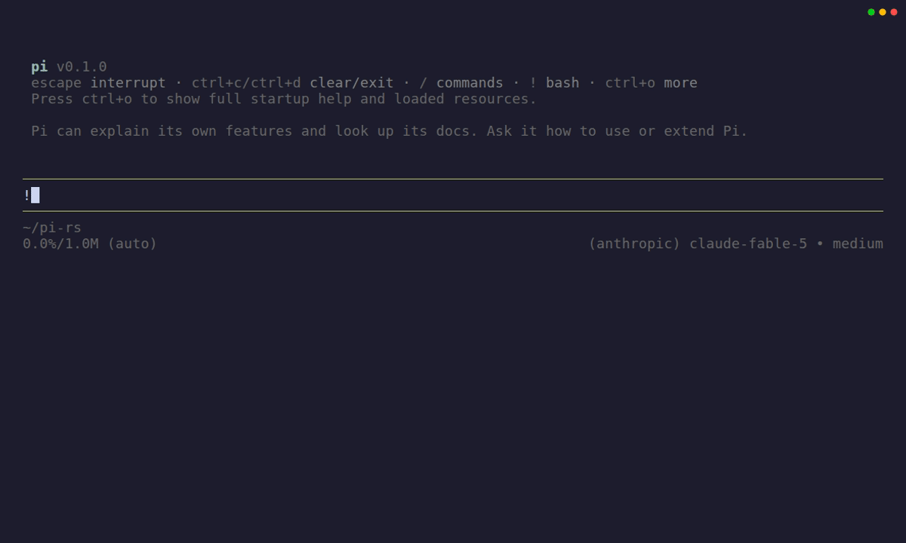

# pi-rs

[Pi](https://github.com/badlogic/pi-mono)'s coding agent, ported to Rust.
The installed executable is `pi` and it uses Pi's runtime identity, including
`~/.pi/agent`, project-local `.pi/`, and `PI_CODING_AGENT_*` overrides.

<p align="center">
  
</p>

The spec is Pi **v0.79.0**, with the development oracle kept in the ignored
`ref/pi` checkout at commit `c5582102`. The compatibility target is strict
visual and behavioral parity, subject only to the exhaustive differences
below. The port is still in progress; the guarantee applies to the parity
release, not unfinished milestones.

## Differences from Pi

This is the complete exception list:

1. **Implementation:** Rust instead of TypeScript. This alone may not change
   observable behavior.
2. **Configuration:** Lua is the only configuration language. Global
   `~/.pi/agent/config.lua` and project `.pi/config.lua` replace Pi's JSON
   configuration files. Settings, keybindings, models/providers, themes,
   resource selection, and extension declarations all pass through this Lua
   configuration surface. Data formats that are not configuration—such as
   sessions, credentials, project instructions, skills, and prompt-template
   content—remain Pi-compatible.
3. **Extensions:** Lua 5.4 instead of TypeScript/JavaScript. Pi extension
   examples are translated to Lua and must retain the same result.
4. **Packages:** packages distribute Lua configuration/extensions rather than
   npm TypeScript/JavaScript. The package transport is still to be finalized.
5. **First-party construction:** tools, agent policy, commands, compaction,
   rendering, the interactive frontend, and themes are independently replaceable
   Lua builtin packages declared through the same public API as user code. A
   feature does not satisfy this rule merely by living inside a large embedded
   Lua chunk; Rust provides mechanism and generic role selection only.
6. **Authoring surface:** pi-rs exposes a Lua-native capability superset of Pi's
   extension API. Builtins and file-backed user extensions receive the same
   mechanisms, including the lifecycle, rendering, process, network, filesystem,
   agent, and session capabilities required by the maintained extension dogfood
   suite. Additive authoring APIs may not alter shipped Pi-compatible behavior.

**Everything else is guaranteed to be exactly Pi-compatible.** Given the same
terminal, credentials, model, input, provider/tool responses, and equivalent
Lua configuration, the parity release must match Pi's rendering, interaction,
requests, errors, CLI behavior, persistence, and session behavior. A new
exception requires updating this list before release; incomplete work does not
count as an exception.

`DESIGN.md` is the normative divergence/architecture contract; `PLAN.md` is
the ordered parity and extension-first ladder. Product experiments belong in
downstream forks, while the general authoring mechanisms and replacement seams
needed to build them belong here.

Build and test:

```sh
cargo test --workspace
nix flake check
```

## Terminal demo

The checked-in GIF is generated from [`demo/pi-rs.tape`](demo/pi-rs.tape).
The recording uses an isolated home directory and offline UI actions, so it
never reads credentials or contacts a model provider.

```sh
nix run .#demo
```

VHS infers the output format from an override's extension:

```sh
nix run .#demo -- --output /tmp/pi-rs.mp4
```

## Updating the built-in model catalog

The runtime reads only the reviewed snapshot in
`crates/pi-rs-ai/data/models.json`; it never fetches model metadata. Refresh it
from upstream with:

```sh
nix run .#update-model-catalog
```

For reproducible review or offline regeneration, pin an upstream revision or
use a local checkout:

```sh
nix run .#update-model-catalog -- --revision <git-revision>
nix run .#update-model-catalog -- --source ref/pi --revision c5582102f51b143fadc05180e0f8aed050e923b3
```

The command also updates `models.provenance.json` with the exact revision,
catalog/output hashes, API inventory, and provider/model counts. Reviewed
upstream metadata corrections belong in `scripts/model-catalog-overrides.json`
and require a reason; runtime code must not special-case catalog rows.

Generation rejects unknown model fields, duplicate IDs, and API protocols
outside the reviewed vocabulary. A new protocol is promoted deliberately:
implement and replay-test its transport first, add it to the updater's accepted
API set, then regenerate and pass `nix flake check`. The scheduled
`model-catalog-update.yml` workflow follows the same path and opens a generated
PR only when the reviewed snapshot changes.
